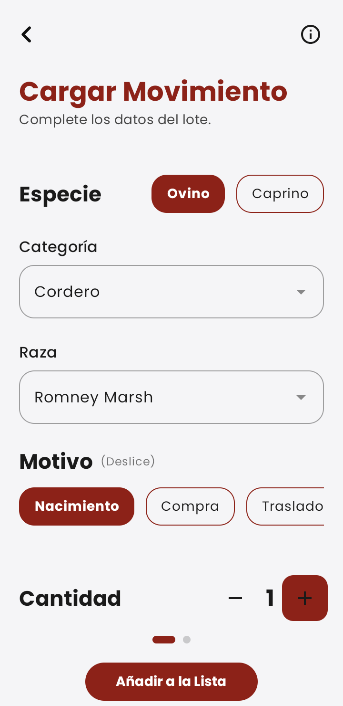
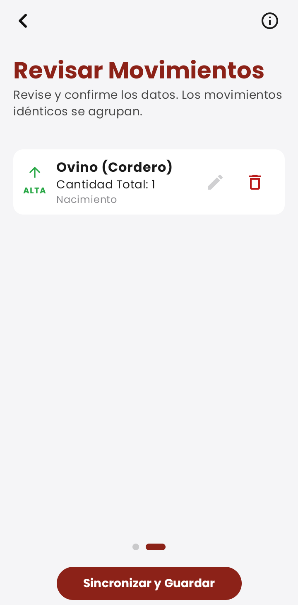

SINC - Plataforma Integral de Gestión Ganadera (INTA)
Documentación Técnica y Showcase de Arquitectura
Este repositorio tiene como finalidad documentar y exponer la arquitectura de software, los patrones de diseño y las soluciones técnicas implementadas en la plataforma SINC. El sistema fue desarrollado como una solución institucional para el INTA Centro Regional Misiones, orientada a la digitalización, logística y monitoreo de la Cuenca Ovino-Caprina en el sector sur de la provincia.

La plataforma aborda la trazabilidad en entornos rurales con conectividad limitada, proporcionando una infraestructura distribuida que integra una plataforma administrativa web y una herramienta de recolección de datos móvil nativa.

1. Arquitectura General del Sistema
El ecosistema SINC se basa en una arquitectura desacoplada donde el servidor central actúa como una API robusta y una interfaz administrativa, mientras que la aplicación móvil funciona como un cliente autónomo con capacidades de procesamiento local y sincronización diferida.

2. Plataforma Web Administrativa
La plataforma web está diseñada para la gestión centralizada, el análisis de información y la georreferenciación de unidades productivas.

Stack Tecnológico
Framework: Laravel 12.

Ecosistema: Laravel Jetstream (Autenticación y gestión de perfiles).

Frontend Reactivo: Livewire y Alpine.js.

Estilos: TailwindCSS.

Geolocalización: Leaflet.js para la renderización de capas espaciales.

Detalles de Implementación
Patrón Actions: Se utiliza para centralizar la lógica de negocio, permitiendo que las mismas operaciones sean invocadas por los controladores web y los endpoints de la API, garantizando la integridad de los datos.

Procesamiento Asíncrono: Uso de Laravel Queues y Jobs para la importación masiva de registros y el procesamiento de archivos GeoJSON en segundo plano, evitando bloqueos en la interfaz de usuario.

3. Aplicación Móvil Nativa (SINC Mobile)
Herramienta nativa diseñada bajo la premisa de resiliencia en campo, garantizando la integridad de la información en zonas de nula conectividad.

Stack Tecnológico
Lenguaje: Kotlin.

UI Framework: Jetpack Compose.

Arquitectura: Clean Architecture con patrón MVVM (Model-View-ViewModel).

Persistencia Local: Room Database.

Comunicación: Retrofit.

Soluciones Técnicas Implementadas
Motor de Delta Sync: Se desarrolló una estrategia de sincronización incremental que permite el trabajo offline-first. El sistema gestiona los registros localmente y automatiza la sincronización hacia el servidor mediante un gestor de estados de red.

Validación Geoespacial: Integración de Osmdroid para cartografía offline. Se implementaron algoritmos de Ray-Casting para verificar en el dispositivo si la ubicación GPS se encuentra dentro de los límites del polígono georreferenciado antes de permitir el registro de eventos.

4. Infraestructura y DevOps
El sistema se gestiona bajo un flujo de trabajo orientado a la automatización y la paridad de entornos.

Contenedorización: Uso de Docker para encapsular los servicios de la plataforma, asegurando un entorno de ejecución consistente.

CI/CD: Implementación de GitHub Actions para automatizar la compilación de assets de frontend y la validación de despliegues.

Administración de Servidores: Gestión directa sobre servidor Linux, incluyendo configuración de hosting, seguridad y mantenimiento de la base de datos.

Notificaciones: Integración de Firebase Cloud Messaging (FCM) para la recepción de alertas críticas en los dispositivos móviles.

5. Galería Visual (Screenshots)
Plataforma Web
La interfaz administrativa permite el monitoreo global y la gestión de la infraestructura geográfica.

Panel Administrativo: Visualización de métricas generales y estado de la cuenca.

Módulo de Georreferenciación: Gestión de perímetros y capas espaciales.

Aplicación Móvil
La interfaz móvil prioriza la carga rápida de datos y el estado de la sincronización.

Flujo de Registro: Formulario reactivo para la captura de movimientos.

Gestión de Sincronización: Interfaz de control para datos pendientes de envío.

Cartografía Offline: Visualización de límites de parcelas sin conexión.

Contexto Institucional
Este proyecto representa el resultado técnico de una pasantía profesional en el INTA Centro Regional Misiones y se integra en la formación académica de la carrera Analista de Sistemas.

Desarrollado por: Leonardo Krasuchi.
